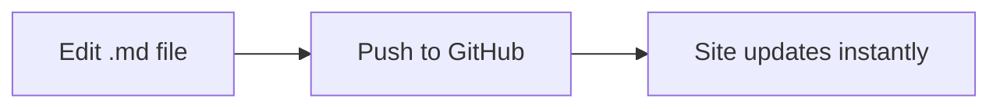

# Welcome

This is the home page of your documentation site.

Edit `docs/home.md` to change this content.

## What's in this repo?

| File / Folder | Purpose |
|---|---|
| `docs/index.html` | Docsify bootstrap — rarely needs editing |
| `docs/_sidebar.md` | **Navigation** — add/remove pages here |
| `docs/_navbar.md` | Top navbar links |
| `docs/assets/css/theme-custom.css` | Visual customisation |
| `docs/*.md` and subfolders | Your content pages |

## Adding a new page

1. Create a `.md` file anywhere under `docs/` (e.g. `docs/guide/my-topic.md`)
2. Add one line to `_sidebar.md`:
   ```
     - [My Topic](guide/my-topic.md)
   ```
3. Commit and push — that's it.

## Markdown tips

You can use standard Markdown plus a few extras:

**Tabs:**

<!-- tabs:start -->

#### **Tab One**

Content for tab one.

#### **Tab Two**

Content for tab two.

<!-- tabs:end -->

**Mermaid diagrams:**



**Font Awesome icons:**  :fas fa-check-circle:  :fas fa-plane:  :fas fa-book:

**Callout tip** (blockquote styling):

> **Tip:** You can click any image to zoom it.
